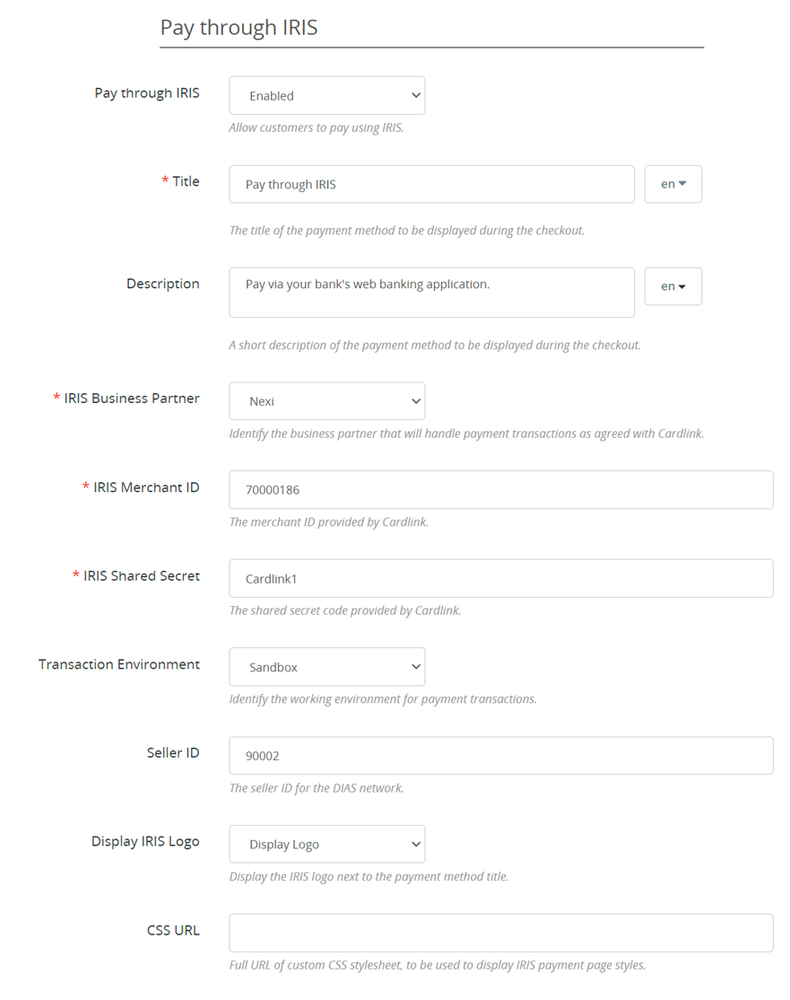

# Cardlink Checkout Payment Gateway

- Contributors: cardlink
- Tags: payments, payment-gateway
- Requires at least: 1.7.x
- Tested up to: 8.2
- Requires PHP: 7.x - 8.x
- License: GPLv2 or later
- License URI: http://www.gnu.org/licenses/gpl-2.0.html

## Changelog
- **1.1.2**
  - Add Cardlink and Worldline as IRIS business partners.
  - Support MySQL versions older than 5.6.5.
  - Fix guest checkout redirect to order confirmation bug.
  - Tested compatibility with version 8.2.
- **1.1.1**
  - Minor fixes.
  - Added translations.
  - Update README.
- **1.1.0**
  - Added support for IRIS payments.
- **1.0.14**
  - Changed flow to create orders only after successful payment.
  - Removed unpaid order cancelation cron job.
- **1.0.13**
  -	Minor bug fixes.
- **1.0.12**
  - Support backorder related order states for sending order confirmation/notification emails only when payment is successful.
- **1.0.11**
  - Enforced creation of pending credit card payment order state.
- **1.0.10**
  -	Minor bug fixes.
- **1.0.9**
  -	Minor bug fixes.
- **1.0.8**
  -	Bug fixes in checkout response controller.
- **1.0.7**
  - Bug fixes.
  - Validate Alpha Bonus digest.
- **1.0.6**
  - Removed billing state from data sent to the payment gateway.
- **1.0.5**
  - Fixed data-module-name value in checkout.
- **1.0.4**
  - Added payment success/denied/canceled/error pages.
- **1.0.3**
  - Added support for Prestashop version 8.0.x, added missing order state, fixed minor bugs.
- **1.0.2**
  - Added hook to disable sending order confirmation email to customer for the waiting payment state.
- **1.0.1**
  - Added settings for order states after successful capture/authorize payments.
  - Added cron job script and HTTP endpoint for canceling orders that have been abandoned (left in waiting for payment for more than 1 hour).
- **1.0.0**
  - Initial release


## Description

Cardlink Payment Gateway allows you to accept payment through various schemes such as Visa, Mastercard, Maestro, American Express, Diners, Discover cards on your website, with or without variable installments.
This module aims to offer new payment solutions to Cardlink merchants for their Prestashop 1.7.x online store without having web development knowledge. However, for the initial module installation some technical knowledge will be required.

Merchants with e-shops will be able to integrate the Cardlink Payment Gateway to their checkout page using the CSS layout that they want. Also, they can choose between redirect or IFRAME option for the payment environment. Once the payment is made, the customer is returned to the online store and the order is updated.
Once you have completed the requested tests and any changes to your website, you can activate your account and start accepting payments. 

## Features

1. A dropdown option for instance between Worldline, Nexi and Cardlink.
2. Option to enable test environment (sandbox). All transactions will be re-directed to the endpoint that represents the production environment by default. The endpoint will be different depending on which acquirer has been chosen from instance dropdown option.
3. Ability to define the maximum number of installments regardless of the total order amount.
4. Ability to define the ranges of the total order amounts and the maximum number of installments for each range.
5. Option for pre-authorization or sale transactions.
6. Option to set different order statuses for transactions with a captured or authorized payment.
7. Option for a user tokenization service. The card token will be stored at the merchant’s e-shop database and will be used by customers to auto-complete future payments. 
8. In-store checkout option: the merchant can configure the payment process to take place inside a pop up with IFRAME to mask the redirection process from the customers.
9. A text field for providing the absolute or relative (to Cardlink Payment Gateway location on server) URL of custom CSS stylesheet, to apply custom CSS styles in the payment page.
10. Translation ready for Greek & English languages.
11.	Support for IRIS payments for Worldline, Nexi and Cardlink acquirers.
12.	The IFRAME feature is not supported for IRIS payments


## Installation

Download the archive at the [Releases page](https://github.com/Cardlink-SA/cardlink-payment-gateway-prestashop/releases).

From your administration, go to ``Modules > Module Manager`` and click on the ``Upload a module`` button. A popup will appear.


Drag and drop your ``.zip`` file or find it and select it through the ``select file`` link. Once the module’s ``.zip`` file has been uploaded and the module installed, you will be asked if you want to configure the module.


## Cookie Security Settings

For security reasons, Web browsers will not send target domain cookies when the referrer website is on another domain and data are POSTed unless the SameSite option of these cookies is set to the value None. If you fail to properly configure the required hosting settings, customers returning from the payment gateway will be automatically logged out from their accounts. The following configuration instructions 
will manipulate all cookies set by your Prestashop store to allow customer sessions to persist after returning from the payment gateway. If you fail to properly set these, customers returning from the payment gateway will be automatically logged out from their accounts.
 
### Through the administration panel

This setting is currently available in Prestashop version 1.7.8.7. If this setting is not available in your installed Prestashop version, follow the manual method. From your administration panel, go to ``Configure > Advanced Parameters > Administration > SameSite cookies`` and changed it from ``Strict`` or ``Lax`` to ``None``. You will need to be running your entire store under SSL protection otherwise, the panel will inform you of the error. 


### Manually

#### Apache Web Server

For hosting solutions running the Apache web server software, you will need to add the following lines to your web site’s root ``.htaccess`` file. Make sure the ``mod_headers`` Apache module is installed and active.

```
<IfModule mod_headers.c>
Header always edit Set-Cookie ^(.*)$ $1;SameSite=None;Secure
</IfModule>
```

#### Nginx Web Server

If your hosting provider uses the Nginx web server instead, you will need to add/edit the following lines of code to your virtual host’s configuration file.

```
location / {
    proxy_cookie_path / "/; SameSite=None; Secure";
    …
}
```

#### Plesk Hosting Control Panel

If you are using Plesk and nginx in proxy mode, under ``Apache & nginx Setting for ... > Additional nginx directives`` add only the following line:

```
proxy_cookie_path / "/; SameSite=None; Secure";
```

If you are only using Apache, add the following configuration lines in the ``Additional Apache directives`` section on the same page. By default, Plesk has the Apache ``mod_headers`` module installed and active however, verify that this is the case for your Plesk installation.

```
<IfModule mod_headers.c>
Header always edit Set-Cookie ^(.*)$ $1;SameSite=None;Secure
</IfModule>
```

If you are unsure or unfamiliar with the actions described above, please ask a trained IT person or contact your hosting provider to do them for you.


## Screenshots

1. The Cardlink Payment Gateway settings screen used to configure the main Cardlink gateway (``Improve > Modules > Module Manager > Cardlink Checkout > Configure``). The bottom panel is only visible when the ``Accept Installments`` configuration option is set and stored to ``Based on Order Amount``. 
 
2. This is the admin page for configuring an order amount range to apply specified maximum number of installments limit (only accessible when the “Accept Installments” configuration option is set to “Based on Order Amount”. A range of minimum to maximum order amount can be set that will limit the maximum selectable number of installments for the order. 

3. This is the front-end of Cardlink Payment Gateway plugin located in checkout page.

4. To set up IRIS payments, you will need to have the Merchant ID, Shared Secret and DIAS Customer ID specifically issued for use with IRIS. Other settings are similar to the ones for Card Payments.

 

##  Support tickets

In case that you face any technical issue during the installation process, you can contact the Cardlink e-commerce team at ecommerce_support@cardlink.gr .